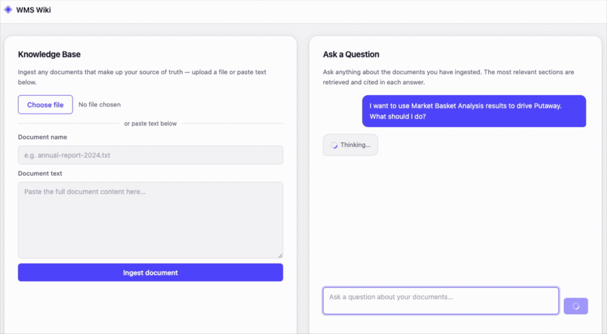

# 🚀 Production-Grade RAG Application

A domain-agnostic, production-oriented **Retrieval-Augmented Generation (RAG)** engine built with **LangChain, FastAPI, Chroma, Voyage AI, Anthropic Claude, and LangSmith**.

The system ingests documentation, retrieves the most relevant information using a **hybrid retrieval + Reciprocal Rank Fusion + cross-encoder reranking pipeline**, and generates grounded answers with **source citations**.

---

## 🎥 Demo



---

## ✨ Key Features

- 🔎 Hybrid semantic + lexical retrieval
- 🧠 Dense vector search using Chroma
- 🔤 BM25 keyword retrieval
- 🔀 Reciprocal Rank Fusion (RRF)
- 🎯 Cross-encoder reranking
- 📚 Section-aware document chunking
- 🔗 Source citations with generated answers
- 🛡️ Prompt-injection-resistant context handling
- 📊 Retrieval and answer-quality evaluation
- 🧪 Automated test suite with pytest
- ⚡ FastAPI backend
- 🖥️ Interactive web interface
- 📈 LangSmith tracing and evaluation
- 🔄 Idempotent and resumable ingestion pipeline

---

## 🏗️ Architecture

```text
                         ┌─────────────────────┐
                         │   Documents / URLs  │
                         └──────────┬──────────┘
                                    │
                                    ▼
                         ┌─────────────────────┐
                         │ Document Ingestion  │
                         └──────────┬──────────┘
                                    │
                                    ▼
                         ┌─────────────────────┐
                         │ Section-aware       │
                         │ Chunking            │
                         └──────────┬──────────┘
                                    │
                         ┌──────────┴──────────┐
                         ▼                     ▼
                ┌─────────────────┐   ┌─────────────────┐
                │ Dense Retrieval │   │ BM25 Retrieval  │
                │ Chroma + Voyage │   │ Lexical Search  │
                └────────┬────────┘   └────────┬────────┘
                         │                     │
                         └──────────┬──────────┘
                                    ▼
                         ┌─────────────────────┐
                         │ Reciprocal Rank     │
                         │ Fusion (RRF)        │
                         └──────────┬──────────┘
                                    │
                                    ▼
                         ┌─────────────────────┐
                         │ Cross-Encoder       │
                         │ Reranking           │
                         └──────────┬──────────┘
                                    │
                                    ▼
                         ┌─────────────────────┐
                         │ LLM Generation      │
                         │ Claude              │
                         └──────────┬──────────┘
                                    │
                                    ▼
                         ┌─────────────────────┐
                         │ Answer + Citations  │
                         └─────────────────────┘


Ingestion
   ↓
Documents
   ↓
Section-aware Chunks
   ↓
┌───────────────────────┐
│ Dense Retrieval       │
│ Chroma + Voyage       │
└───────────┬───────────┘
            │
            ├──────────────┐
            │              │
            ▼              ▼
      Dense Results    BM25 Results
            │              │
            └──────┬───────┘
                   ▼
          Reciprocal Rank
             Fusion
                   ↓
          Cross-Encoder
            Reranking
                   ↓
              Top-K
                   ↓
             LLM / Claude
                   ↓
          Answer + Citations

## 📊 Measurement-First Evaluation

Retrieval and answer quality are evaluated against a golden dataset using LangSmith.
Evaluation Metrics
- retrieval_recall — determines whether retrieval surfaces the correct source section.
- groundedness — evaluates whether the generated answer is supported by the retrieved context.
- correctness — evaluates whether the generated answer matches the reference answer.
The evaluation pipeline uses a separate judge model from the model being evaluated.
Because each retrieval stage is independently callable, the following variants can be compared:

                        Dense Retrieval
                             ↓
                        Hybrid Retrieval
                             ↓
                        Hybrid + Reranking


## 📥Ingestion
The application supports two ingestion workflows.
Bulk HTML Ingestion
The scripts/ingest_html.py script crawls a linked HTML documentation source using standard rel="next" navigation.

python -m scripts.ingest_html \
    --start-url https://example.com/docs/index.html \
    --source mydocs \
    --release v1 \
    --content-selector div.body

Use --dry-run to validate crawling and chunking without embedding or storing documents.


Ad-hoc Document Ingestion
Documents can also be uploaded or pasted directly through the application's UI.
The /documents API endpoint and frontend ingestion panel feed documents into the same:

Document
   ↓
Section Parsing
   ↓
Chunking
   ↓
Embedding
   ↓
Vector Store


The ingestion pipeline is designed to be idempotent and cost-aware:
- Stable chunk IDs prevent duplicate documents.
- Existing chunks are not unnecessarily re-embedded.
- Only changed content is re-embedded.
- Bulk ingestion commits incrementally.
- Embedding requests respect provider rate limits.
- Token-aware batching, pacing, and backoff are supported.
- Long ingestion runs can be resumed.


🛠️ Tech Stack
Concern	Technology
API / Backend	FastAPI
Orchestration	LangChain
Vector Store	Chroma
Dense Embeddings	Voyage AI (voyage-3)
Keyword Retrieval	BM25
Reranking	Voyage AI (rerank-2.5)
Generation	Anthropic Claude
Evaluation & Tracing	LangSmith
Testing	pytest
Frontend	HTML / CSS / JavaScript


## 📁 Project Structure 

app/
├── core/
│   ├── ingestion/
│   │   └── HTML source parsing → ParsedSection
│   ├── chunking.py
│   │   └── ParsedSection → Chunk
│   ├── vectorstore.py
│   │   └── Chroma + Voyage embeddings
│   ├── retrieval.py
│   │   └── Hybrid retrieval + RRF + reranking
│   └── rag.py
│       └── Ingestion, query handling, citations
│
├── api/
│   └── v1/
│       └── API routes
│
├── schemas/
│   └── Request / response models
│
eval/
├── golden_set.py
├── evaluators.py
└── run_eval.py

scripts/
├── ingest_html.py
└── build_dataset.py

tests/
├── test_chunking.py
├── test_evaluators.py
├── test_golden_set.py
├── test_html_parser.py
├── test_ingest.py
├── test_rag.py
└── test_retrieval.py

frontend/
├── index.html
├── css/
│   └── style.css
└── js/
    └── app.js

⚙️ Setup

Requirements
- Python 3
- Anthropic API key
- Voyage AI API key
- LangSmith API key

Install the project dependencies:
pip install -r requirements.txt

Create a .env file in the project root:
ANTHROPIC_API_KEY=your_anthropic_api_key
VOYAGE_API_KEY=your_voyage_api_key
LANGSMITH_API_KEY=your_langsmith_api_key


🚀 Usage
1. Ingest a Documentation Corpus

python -m scripts.ingest_html \
    --start-url https://example.com/docs/index.html \
    --source mydocs \
    --release v1 \
    --content-selector div.body


    For a validation-only run:

      python -m scripts.ingest_html \
      --start-url https://example.com/docs/index.html \
      --source mydocs \
      --release v1 \
      --content-selector div.body \
      --dry-run

2. Start the Application

uvicorn app.main:app --reload --port 8001

     Open:
     http://127.0.0.1:8001/

     The web interface allows you to:

      - Upload documents
      - Paste document content
      - Ingest knowledge into the system
      - Ask questions about the ingested corpus
      - Receive grounded answers
      - View source citations


🧪 Testing

Run the complete test suite with:
pytest -v

The project includes tests covering:
- Chunking
- HTML parsing
- Document ingestion
- Retrieval
- RAG behavior
- Evaluation logic
- Golden-set handling


📈 Evaluation

Build the evaluation dataset:
python -m scripts.build_dataset

Run the evaluation experiment:
python -m eval.run_eval

Evaluation requires:
LANGSMITH_API_KEY=your_langsmith_api_key

The evaluation workflow measures retrieval and answer quality across different retrieval configurations.


🗺️ Roadmap
- Conditional / document-type-aware ingestion
- PDF ingestion support
- Structure-agnostic document fallbacks
- Query-aware retrieval strategies
- Image and diagram handling
- Dynamic result counts based on reranking scores
- Output sanitization
- Additional observability and production hardening